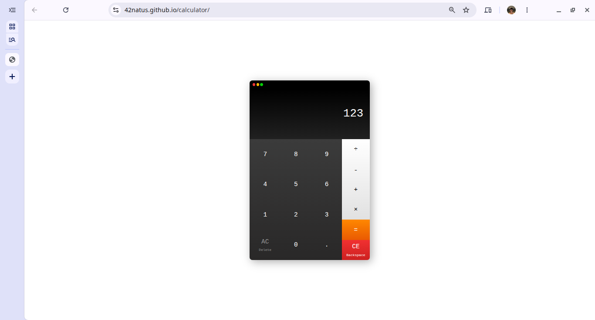

# calculator
A simple web-based calculator. The project is part of the curriculum of The Odin Project's **Foundations** path.

## Features

1. A numpad and some operators for basic calculations (division, subtraction, addition, and multiplication).

2. Support for entering floating point numbers as operands.

3. Keyboard support.

## How it works

The buttons send the digits for each operand and the operator to the script where they are evaluated and the result is displayed on the calculator's display.

The calculator also responds to the keyboard so the user can input digits, choose an operator, evaluate, backspace and clear the calculator's memory without using their mouse.

## Live Demo

Check it out [here](https://42natus.github.io/calculator/).

## Screenshot

